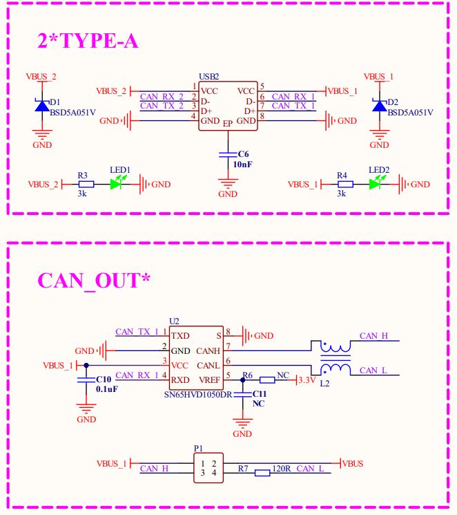
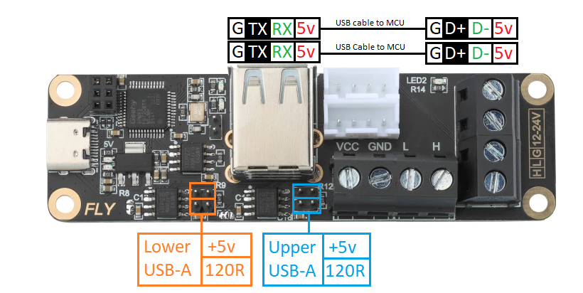

# Understanding the UTOC/U2C USB A ports
There has been a bit of misunderstang in regards to the UTOC-3/U2C-3 USB A ports.  
First off the USB-A ports on the BTT U2C-3 and the Mellow Fly UTOC-3 are not a USB hub and can't be configured to work as one. 

The USB-A ports are intended to allow devices that are capabile of communicaton by CAN bus protocol but lack a CAN transciever to join a CAN bus network. 
This would include mot of the STM32 CPUs and RP2040 devices that have avaliable open GPIO pins to connect as RX/TX to the CAN transciever. 

As shown on the [BTT U2C](https://github.com/bigtreetech/U2C/blob/master/BIGTREETECH%20U2C%20V1.1.pdf) schematic below the USB-A ports are connected to CAN1 and CAN2. There is no connection to a USB circuit.      

Each of the 2 USB-A ports ( top and bottom) has it's own CAN transciever IC, a jumper for a 120 ohm resistor to terminate the CAN bus and a +5V jumper to supply power out of the USB-A to to the device conected to it if power is needed.   The jumpers on the left as pictured are for the lower USB-A port and the jumpers on the right are for the upper USB-A port. 

Remember that no matter how many devices are on the CAN bus you one want to have two 120ohm termination resistors enabled on the bus. You want to measure 60 ohms across CAN H and CAN L with all devices connected. 

## Klipper Configuration 
 Below is a set of configuration screen shots for some MCUs that can run on CAN through the control board USB port connected to a UTOC/U2C USB A port. 
 THis is not a complete list. That are many more than what I have listed here.
 
 - [V0 Display](https://github.com/Polar-Ted/Voron-V0-Display-on-CANBUS/raw/main/Images/V0_display_canboot_can.png)
 - [Fysetc STM32 Mini12864]()

## Pin Diagrams

 - BTT U2C-3      
         

 - [Mellow Fly UTOC-3](https://mellow-3d.github.io/fly-utoc_pins.html)       
         

## Links

 - [Big Tree Tech U2C Github ](https://github.com/bigtreetech/U2C)
 - [Mellow UTOC Github](https://mellow-3d.github.io/fly-utoc_general.html)
 
